# Overview
This repo contains a tutorial on how to set up an agent in ADK.
The goal of the agent is to troubleshoot IT systems.
It will gather information about the health status of IT systems and find corresponding solutions based on IT manuals.
The goal of the tutorial is to give basic understanding on how to:
- develop a multi-agent system using Google Agent Development Kit (ADK),
- connect to a remote MCP Server and use its tools,
- use standard tools in ADK, to connect to Vertex AI Search for document retrieval,
- deploy the multi-agent system to Gemini Enterprise.
Furthermore, it contains a simple MCP Server, written with FastMCP, which will be deployed to Google Cloud Run.

# Table of Contents
1. Overview
2. Table of Contents
3. Deployment
   1. Prerequisites
   2. Gemini Enterprise
   3. Create the Agent Data Store
   4. Deploy the MCP Server
   5. Test Agent locally
   6. Deploy Agent


# Deployment
## Prerequisites
It is required to have the **Google Cloud CLI** installed on your machine.
You can find a guide to install it here: https://docs.cloud.google.com/sdk/docs/install

Before running the project, create an .env file inside the root directory of this project.
From the root directory, run the following command to create the file:
> ‼️variables are marked with this format: {i_am_variable}, make sure to replace it with the actual value. Replace the whole string, including the brackets.
> 
```bash
cat <<EOF > .env
GOOGLE_CLOUD_PROJECT={google_cloud_project}
GOOGLE_GENAI_USE_VERTEXAI=true
GOOGLE_CLOUD_LOCATION=europe-west1
EOF
```
To make the environment variables accessible in your current terminal window, run the following command.
If you like to use another location for this project, make sure Gemini Enterprise does support this.
At the moment only **europe-west1** and **us-central1** are supported (as seen [here](https://docs.cloud.google.com/gemini/enterprise/docs/register-and-manage-an-adk-agent#reasoning-engine-location)).
```bash
source .env
```

## Gemini Enterprise
To activate Gemini Enterprise and create a Gemini Enterprise App, follow the first steps of this [Tutorial](https://docs.cloud.google.com/gemini/enterprise/docs/quickstart-gemini-enterprise).

⚠️ Make sure to create the App in the region eu.


**DO NOT** create the Data Store at this moment.
After you created the Gemini Enterprise App, store the **ID** of the App in your environment file.
You will find the App ID in the "Apps" Overview in Gemini Enterprise
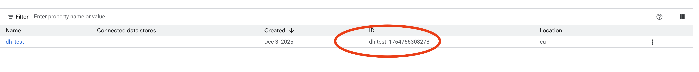

```bash
cat <<EOF >> .env
GEMINI_ENTERPRISE_APP_ID={gemini_enterprise_app_id}
EOF
```
## Create the Agent Data Store
In this step you will create a Data Store. 
The Data Store will contain the manuals of the IT systems your agent will later search in.
The documents are in pdf format.
### Google Cloud Bucket
Before creating the Data Store, you need to upload the documents in Google Cloud Bucket.
In Cloud Console, search for Buckets. 
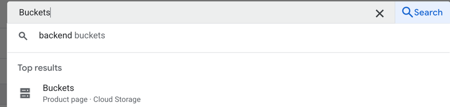
Click on Create.
Create a new bucket.
Give it a name and set your preferred location.
Then scroll to the bottom and click on create.
After the bucket was created, upload the file to the bucket. 
The pdf files of the manuals are stored in `` documents/it_manuals ``
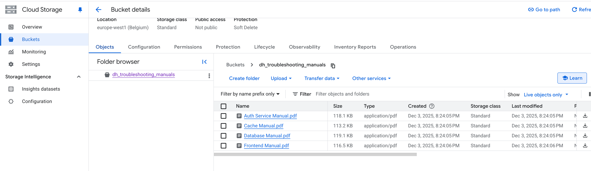

### Agent Data Store
After the bucket is created and the files are uploaded, the next step is to create the actual Data Store.
A Data Store can be used to search through the content of the files.
Therefore, go back to Gemini Enterprise, into the App you created previously.
On the left pane, click on "Connected data stores" -> "New datastore".
In the opening window, you see all the connectors which can be used with Gemini Enterprise.
Search for "Cloud Storage"
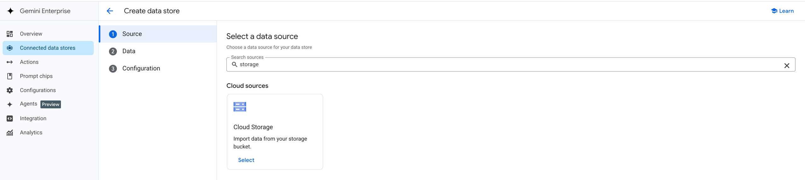
Select "Unstructured Data" as Specialized Data Import and "Periodic" as Synchronization frequency.
When you chose "Periodic", you can manually rerun the import if anything fails, or you want to add other files to the datastore later.
If you chose "One time", it will only run one time and it is not possible to restart the indexing.
For Sync frequency you can choose the lowest frequency possible, "Every 5 days".
Also make sure to select the bucket, which was created perviously.
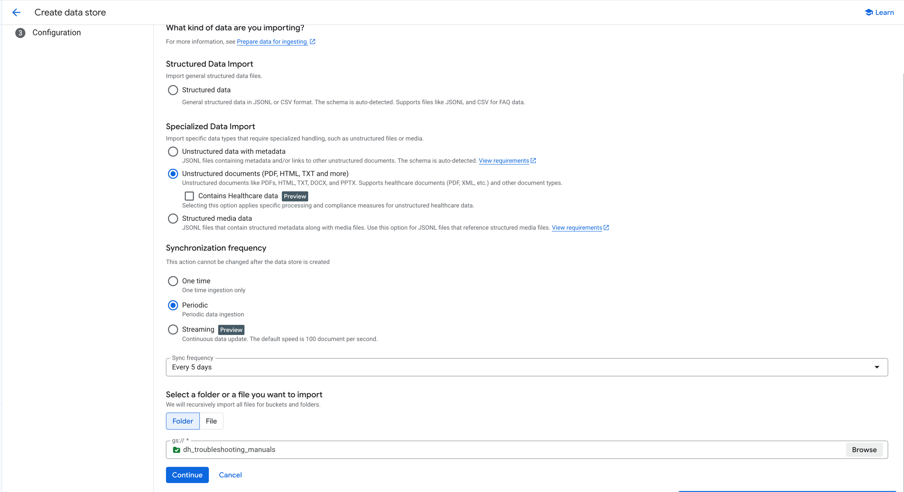
Then click on "Continue".
Now give the datastore a name and click on Create
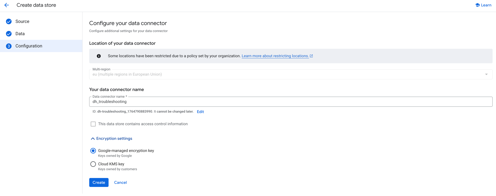
The datastore will now be created.
This will take some time, as the data will be indexed.
When the Status is "Active", the datastore is ready to use.
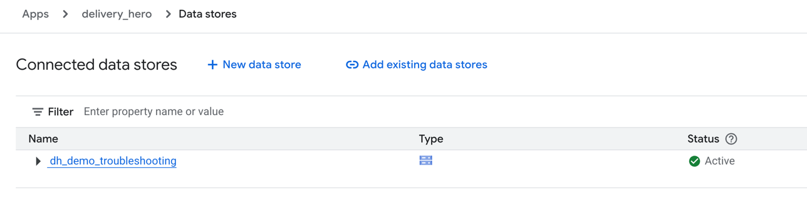

When it is successfully created, the datastore will have a child element, called "gcs_store".
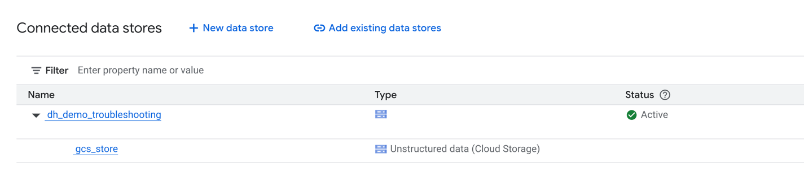

When you click on it, you should be able to see the indexed files.
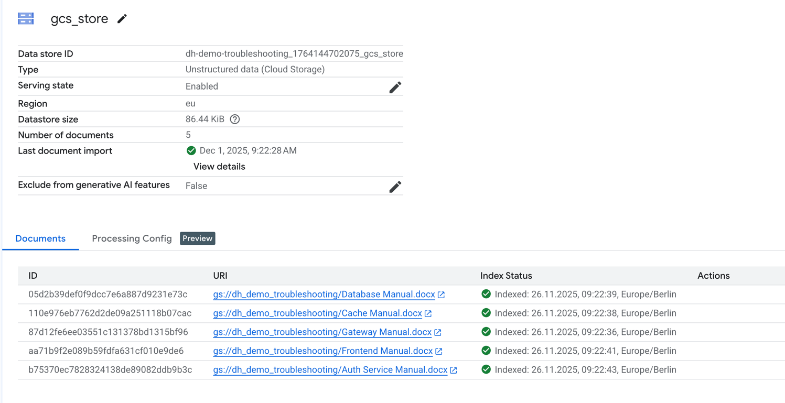

If the files are not indexed, but the datastore is created (Status is "Active"), you can manually trigger the indexing, by going on the parent datastore (here dh_demo_troubleshooting) and click on "Manual Sync" in the upper right corner.
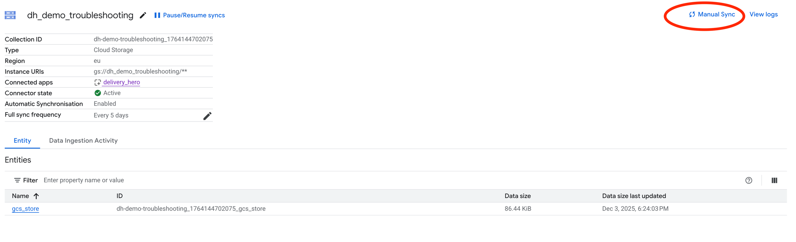

As soon as the datastore is indexed, it can be used by the agent.

Extend your .env file with the id of the "gcs_store". 
It ends, with _gcs_store
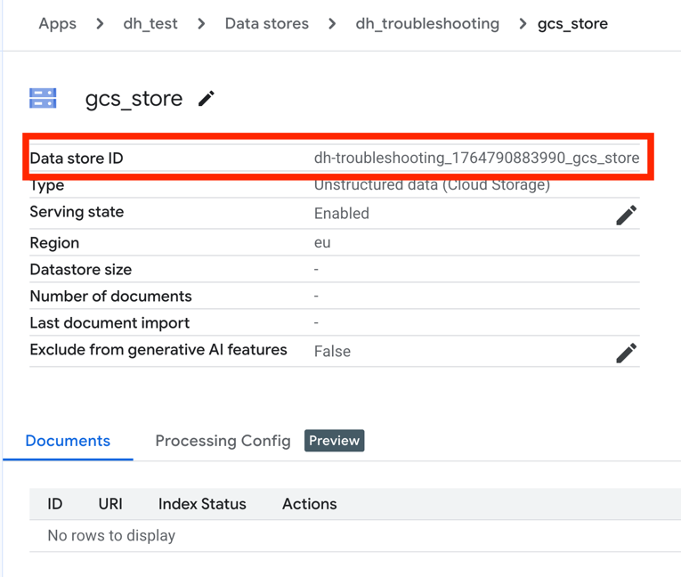
```bash
cat <<EOF >> .env
DATASTORE_ID={datastore_id}
EOF
```

## Deploy the MCP Server
As the agent is connecting to a MCP Server, the next step is to create the MCP Server.
There is one very basic example in the `` mcp/ `` folder in this repository.

Make sure, that you are logged in.
```bash
gcloud auth login --update-adc
```

Verify, that the correct project is configured in your environment.
```bash
gcloud config list
```
In the output you see the currently configured project, if it is not the one you want to deploy the mcp server in, you can change it by running the following command
```bash
gcloud config set project {google_cloud_project_id}
```

To deploy the MCP Server, Google Cloud build will be used.
Cloud build will store the artifacts of the built containers in a bucket.
At first this bucket needs to be created.
It must be named "{project_id}_cloudbuild".
```bash
gcloud storage buckets create gs://{project_id}_cloudbuild --location=europe-west4
```
The next step trigger a build using cloud build.
The first time the command is run, it may fail, but it should create some necessities, like the default compute service account.
If the commands fail, follow the description below and rerun the deployment. 
```bash
cd mcp
gcloud run deploy mcp-server --allow-unauthenticated --region=europe-west4 --source .
```
You can choose another region, if you prefer.
This will create a new instance of the mcp server in Cloud Run.
If the command, asks to enable APIs or set permissions, prompt Y.
You may be asked multiple things, confirm everything by prompting Y.

>⚠️ The command may fail, due to access restrictions.
> The most common issue is, that it created a new bucket but the default service account is missing permission.
If that is the case, locate the freshly created bucket, its name should be like this. "run-sources-{project_id}-{region}".
> You can now set the permissions, via Cloud Console or using the following command:
> Before deploying, some roles need to be set to the default compute service account.
> ```bash
> gcloud projects add-iam-policy-binding {project_id} \
>    --member='serviceAccount:{project_number}-compute@developer.gserviceaccount.com' \
>    --role='roles/logging.logWriter'
> ```
> ```bash
> gcloud storage buckets add-iam-policy-binding gs://{project_id}_cloudbuild \
>    --member='serviceAccount:{project_number}-compute@developer.gserviceaccount.com' \
>    --role='roles/storage.objectViewer'
>
>  gcloud artifacts repositories add-iam-policy-binding cloud-run-source-deploy \
>    --location={region} \
>    --member='serviceAccount:{project_number}-compute@developer.gserviceaccount.com' \
>    --role='roles/artifactregistry.writer' \
>    --project={project_id}
> ```

Add the url to the MCP Server to your .env file. Be aware of the /mcp at the end of the url.
```bash
cat <<EOF >> .env
MCP_URL="{mcp_url}/mcp"
EOF
```


## Test Agent locally
Before starting make sure you are in the root directory, to continue.
### Create and activate your virtual environment
It is recommended to use **Python 3.12** to create your virtual environment.

```bash
python -m venv .venv
source .venv/bin/activate
```

### Prerequisites

install dependencies using

```
pip install -r WorkshopAgent/requirements.txt
```

Configure the right project
```bash
gcloud config set project {google_cloud_project}
```

Login
```bash
gcloud auth login --update-adc
```

### Local Testing
To start the web interface and test agents, navigate to the root directory and run:
```
adk web
```
Open the url from the output of the command in your browser.
It should be localhost:8000/ or similar.
In the upper left corner of the application, you can choose which agent to use, chose "WorkshopAgent".
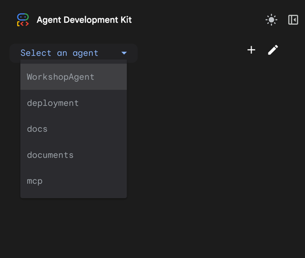

You should now be able to chat with the agent.
An example interaction could look like this:


## Deploy Agent
To deploy the agent, you need to create another bucket.
This buckets holds the images of the agents deployed to Agent Engine.
Create the bucket as described in the [Google Cloud Bucket Section](#google-cloud-bucket).

Add the URL of the Bucket to your .env, alongside with some other values.
It should look like this.
```bash
GOOGLE_CLOUD_PROJECT="{project_id}"
GOOGLE_GENAI_USE_VERTEXAI=true
GOOGLE_CLOUD_LOCATION=europe-west1
STAGING_BUCKET="gs://{bucket_name}"
AGENT_NAME="Troubleshooting_Agent"
AGENT_DESCRIPTION="Agent to troubleshoot IT systems"
GEMINI_ENTERPRISE_APP_ID="{gemini_enterprise_app_id}"
DATASTORE_ID="{datastore_id}"
MCP_URL="https://{mcp_url}/mcp"
```

### Creating a new Agent in Agent Engine
To create a new Agent in AgentEngine, make sure you have **NOT** set the REASONING_ENGINE variable in your .env file.
Then simply run the deployment/deploy_agent.py from your root directory.
```bash
python deployment/deploy_agent.py
```
The script shows the created reasoning agent as output, store the value in the REASONING_ENGINE env variable. 
When you now run the deployment script it will update the existing agent instead of creating a new one.

### Update an existing Agent
Make sure you set the REASONING_ENGINE env var with the value of your reasoning engine:
```bash
cat <<EOF >> .env
REASONING_ENGINE="projects/{project_id}/locations/{location}/reasoningEngines/{agent_id}"
EOF
```
Then simply run the deployment/deploy_agent.py from your root directory.
```bash
python deployment/deploy_agent.py
```

### Try out the Agent
Your agent should now be deployed.
You can try it, by going to Gemini Enterprise in the Cloud Console.
On the left side, there is a tab, called "Integration".
When you enter this page the first time, you will be asked to configure the identity provider.
Use "Use Google Identity" for now.
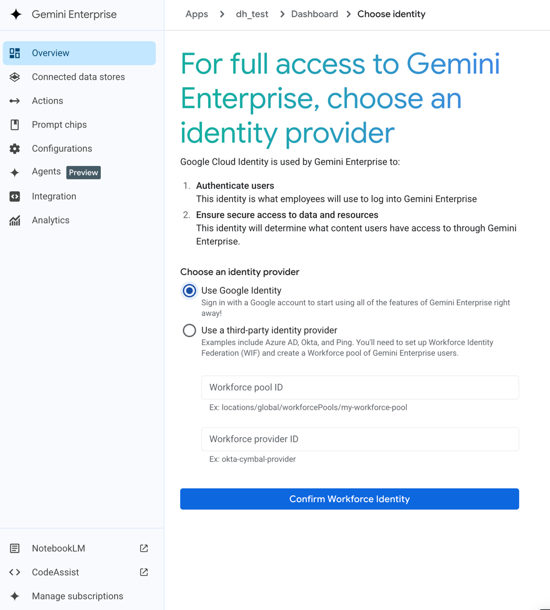

Click on Integration again, and you see the link to the Gemini Enterprise Instance.
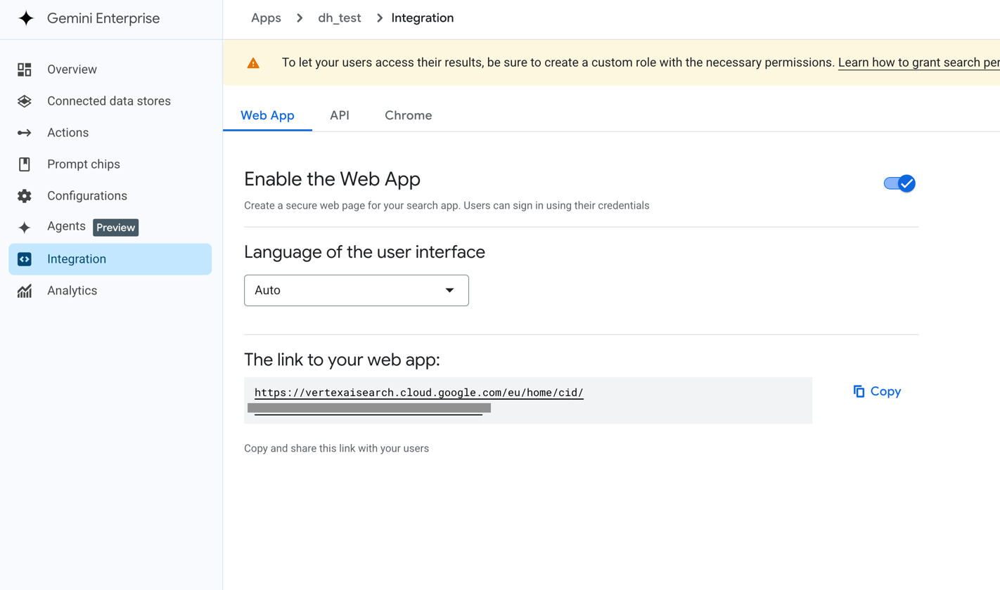

In the left panel of Gemini Enterprise, you can click on "Agents". 
This brings you, to the Agent gallery, where you can see all deployed agents.
Here you can click on the "Troubleshooting_Agent".
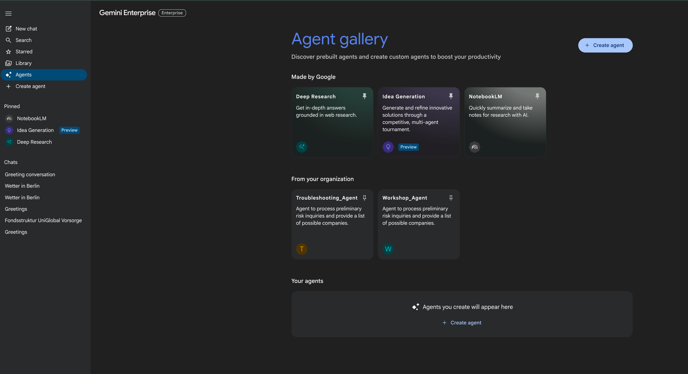
If you click on it, you can use it the same way as locally.
